# TynocStore

A full-stack e-commerce store with an admin dashboard, built as an internship
project with **Next.js 16 (App Router)**, **TypeScript**, **Tailwind CSS**,
**AWS DynamoDB**, and **Zod**.

Shoppers browse, search, and filter a product catalog, keep a cart and a
wishlist, and sign up. Admins log in to a password-protected dashboard to see
live store metrics, manage products and categories, and inspect every user's
cart and wishlist straight from the database.

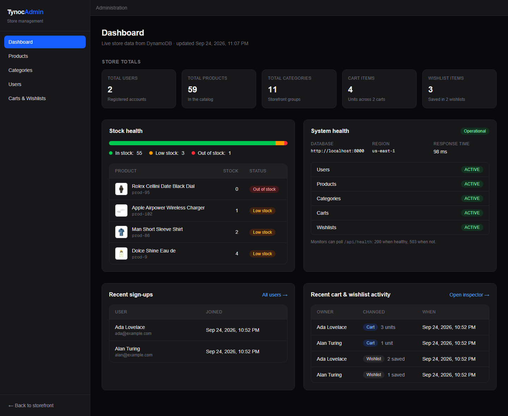

---

## Table of Contents

- [Quick Start](#quick-start)
- [Features](#features)
- [Tech Stack](#tech-stack)
- [Architecture](#architecture)
- [Project Structure](#project-structure)
- [Environment Variables](#environment-variables)
- [DynamoDB Setup](#dynamodb-setup)
- [Running Locally](#running-locally)
- [Running with Docker](#running-with-docker)
- [API Reference](#api-reference)
- [Security](#security)
- [Testing](#testing)
- [Available Scripts](#available-scripts)
- [Product Catalog & Images](#product-catalog--images)
- [Git Workflow](#git-workflow)
- [Screenshots](#screenshots)
- [Known Limitations & Next Steps](#known-limitations--next-steps)

---

## Quick Start

Requires **Node.js 22+** and **Docker Desktop** (for a local database).

```bash
# 1. Start a local DynamoDB (from the repo root)
docker compose up -d dynamodb-local

# 2. Configure the app
cd frontend
npm install
cp .env.example .env.local      # then set ADMIN_PASSWORD (see below)

# 3. Create the tables and load demo data
npm run db:create-tables
npm run db:seed

# 4. Run it
npm run dev
```

- Storefront: http://localhost:3000
- Admin dashboard: http://localhost:3000/admin (log in with `ADMIN_USERNAME` /
  `ADMIN_PASSWORD` from `.env.local`)

---

## Features

**Storefront**

- Responsive homepage (mobile / tablet / desktop) with category filtering and search
- Product detail pages with related products
- Cart: add, change quantity, remove; stock-aware (can't add more than is in stock)
- Subtotal always computed on the server (prices are never trusted from the client)
- Wishlist with duplicate prevention
- Guest carts and wishlists via an httpOnly session cookie
- Loading skeletons, empty states, error boundaries and 404 pages

**Admin dashboard (`/admin`)**

- **Dashboard**: live totals for users, products, categories, cart items and
  wishlist items; stock health; recent sign-ups; recent cart/wishlist activity;
  system health for every DynamoDB table
- **Products**: searchable, filterable table; add and edit forms (Server
  Actions + Zod); inline stock editor (instant PATCH); delete with confirmation
- **Categories**: add/edit modals with auto-generated slugs; deletion is
  blocked while products still use a category (HTTP 409)
- **Users**: registered users with cart and wishlist activity; a detail page
  per user with their cart, wishlist and the raw DynamoDB records
- **Cart & Wishlist Inspector**: every cart and wishlist with its owner resolved
  (user or guest), plus a per-product view; flags items that point at deleted
  products or exceed current stock
- Password protection (HTTP Basic auth), error boundaries, and an empty state
  with a next step on every table

---

## Tech Stack

| Layer      | Technology                                   |
| ---------- | -------------------------------------------- |
| Framework  | Next.js 16 (App Router, Turbopack)           |
| Language   | TypeScript                                   |
| Styling    | Tailwind CSS v4                              |
| Database   | AWS DynamoDB (`@aws-sdk/lib-dynamodb`)       |
| Validation | Zod 4                                        |
| Runtime    | Node.js 22                                   |
| Local dev  | DynamoDB Local in Docker, `tsx` test scripts |

---

## Architecture

The app is layered so that the UI never talks to the database directly and
each layer has one job.

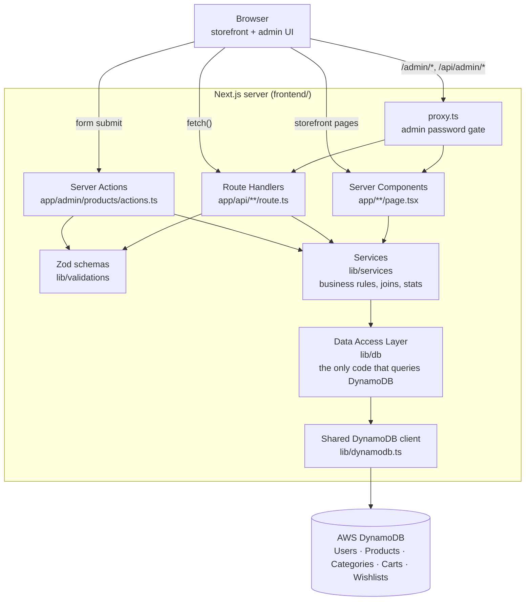
```mermaid
flowchart TD
    Browser["Browser<br/>storefront + admin UI"]

    subgraph Next["Next.js server (frontend/)"]
        Proxy["proxy.ts<br/>admin password gate"]
        Pages["Server Components<br/>app/**/page.tsx"]
        Actions["Server Actions<br/>app/admin/products/actions.ts"]
        Routes["Route Handlers<br/>app/api/**/route.ts"]
        Validation["Zod schemas<br/>lib/validations"]
        Services["Services<br/>lib/services<br/>business rules, joins, stats"]
        DAL["Data Access Layer<br/>lib/db<br/>the only code that queries DynamoDB"]
        Client["Shared DynamoDB client<br/>lib/dynamodb.ts"]
    end

    DB[("AWS DynamoDB<br/>Users · Products · Categories · Carts · Wishlists")]

    Browser -->|"/admin/*, /api/admin/*"| Proxy
    Proxy --> Pages
    Proxy --> Routes
    Browser -->|"storefront pages"| Pages
    Browser -->|"fetch()"| Routes
    Browser -->|"form submit"| Actions
    Routes --> Validation
    Actions --> Validation
    Pages --> Services
    Routes --> Services
    Actions --> Services
    Services --> DAL
    DAL --> Client
    Client --> DB
```

**Why it is structured this way**

- **One place for database code.** Only `lib/db/*` sends DynamoDB commands, so
  a table rename, a new index or caching changes one layer, not the UI.
- **Business rules live in services.** Stock checks, the "category still in use"
  rule and the cart/wishlist joins are in `lib/services/*`, shared by pages,
  API routes and Server Actions.
- **Validate at the edge.** Every write is checked with Zod before it reaches a
  service, and the same schemas power the admin forms' error messages.
- **Server-first rendering.** Pages are Server Components that read data on the
  server; only interactive pieces (cart drawer, stock editor, modals) ship
  JavaScript to the browser.

**Data model.** DynamoDB has no joins or foreign keys, so relationships are
resolved in code:

- Every table uses a single partition key `id` (String).
- A cart's or wishlist's `id` is its **owner's id** (a user id, or a guest
  session id from the `tynoc_session` cookie), so loading someone's cart is one
  key lookup (`GetCommand`).
- Products referenced by carts and wishlists are fetched in batches of up to
  100 with `BatchGetCommand`.
- Dashboard counts use `Select: "COUNT"` and projection scans, so no item data
  is transferred just to count it. Every scan follows `LastEvaluatedKey`
  pagination.

---

## Project Structure

```
tynoctech_project/
├── docker-compose.yml            # DynamoDB Local + the app container
├── docs/screenshots/             # Screenshots used in this README
└── frontend/                     # Next.js application
    ├── proxy.ts                  # Password gate for /admin and /api/admin
    ├── next.config.ts            # standalone output, image hosts, security headers
    ├── Dockerfile                # Multi-stage production image (non-root)
    ├── .env.example              # Template for .env.local (placeholders only)
    ├── app/
    │   ├── layout.tsx            # Root layout (fonts, global CSS)
    │   ├── error.tsx             # App-wide error boundary
    │   ├── global-error.tsx      # Last-resort boundary for the root layout
    │   ├── not-found.tsx         # Global 404
    │   ├── (store)/              # Storefront: home, products/[id], cart, wishlist
    │   ├── admin/                # Admin: dashboard, products, categories,
    │   │                         #        users, inspector (+ error/loading/404)
    │   └── api/                  # Route Handlers (see API Reference)
    ├── components/               # Storefront components and providers
    │   └── admin/                # DataTable, StatCard, EmptyState, modals, forms...
    ├── config/
    │   ├── tables.ts             # DynamoDB table names (single source)
    │   └── images.ts             # Allowed remote image hosts
    ├── lib/
    │   ├── dynamodb.ts           # Shared DynamoDB clients
    │   ├── auth/admin.ts         # Basic auth check (constant-time compare)
    │   ├── session.ts            # Guest session cookie
    │   ├── db/                   # Data Access Layer (+ stats.ts, health.ts)
    │   ├── services/             # Business logic: products, categories,
    │   │                         #   inspector, dashboard
    │   └── validations/          # Zod schemas
    ├── scripts/                  # create-tables, seed, end-to-end tests
    └── types/index.ts            # Shared TypeScript interfaces
```

---

## Environment Variables

Copy `frontend/.env.example` to `frontend/.env.local`. **`.env.local` is
git-ignored and must never be committed**; `.env.example` contains
placeholders only.

| Variable                | Required         | Description                                               |
| ----------------------- | ---------------- | --------------------------------------------------------- |
| `AWS_REGION`            | Yes              | e.g. `us-east-1`                                          |
| `AWS_ACCESS_KEY_ID`     | Yes              | IAM access key (any dummy value for DynamoDB Local)       |
| `AWS_SECRET_ACCESS_KEY` | Yes              | IAM secret key (any dummy value for DynamoDB Local)       |
| `ADMIN_USERNAME`        | Yes (production) | Admin login name                                          |
| `ADMIN_PASSWORD`        | Yes (production) | Admin password; use a long random value                   |
| `DYNAMODB_ENDPOINT`     | No               | e.g. `http://localhost:8000` for DynamoDB Local; unset = AWS |
| `PRODUCTS_TABLE_NAME`   | No               | Defaults to `Products`                                    |
| `CATEGORIES_TABLE_NAME` | No               | Defaults to `Categories`                                  |
| `CARTS_TABLE_NAME`      | No               | Defaults to `Carts`                                       |
| `WISHLISTS_TABLE_NAME`  | No               | Defaults to `Wishlists`                                   |
| `USERS_TABLE_NAME`      | No               | Defaults to `Users`                                       |

Generate a strong admin password with:

```bash
node -e "console.log(require('crypto').randomBytes(18).toString('base64url'))"
```

If `ADMIN_USERNAME` / `ADMIN_PASSWORD` are not set, the admin area is **open in
development** (for convenience) and **locked with HTTP 503 in production**.

---

## DynamoDB Setup

| Table        | Partition key | Stores                                         |
| ------------ | ------------- | ---------------------------------------------- |
| `Users`      | `id` (String) | Registered users (name, email, createdAt)      |
| `Products`   | `id` (String) | Catalog (price, stock, categoryId, image)      |
| `Categories` | `id` (String) | Categories; `id` is the slug                   |
| `Carts`      | `id` (String) | One cart per owner: `items[{productId, quantity}]` |
| `Wishlists`  | `id` (String) | One wishlist per owner: `items[{productId, addedAt}]` |

### Option A: DynamoDB Local (no AWS account)

1. From the repo root: `docker compose up -d dynamodb-local`
2. In `frontend/.env.local` set `DYNAMODB_ENDPOINT=http://localhost:8000` and
   dummy AWS keys (for example `local` / `local`).
3. From `frontend/`: `npm run db:create-tables` then `npm run db:seed`.

> DynamoDB Local runs **in memory** here. After the container restarts, run
> `db:create-tables` and `db:seed` again.

### Option B: Real AWS

1. Create an IAM user with access limited to these five tables (least
   privilege) and put its keys in `frontend/.env.local`. Leave
   `DYNAMODB_ENDPOINT` unset.
2. `npm run db:create-tables` (tables use on-demand billing), then
   `npm run db:seed`.

---

## Running Locally

```bash
cd frontend
npm install
cp .env.example .env.local   # then edit values
npm run dev
```

Open http://localhost:3000 (Next.js picks another port, such as 3001, if 3000 is
busy; use the URL printed in the terminal). If the database is unreachable,
pages still load and show a "Could not load" message instead of crashing, and
the dashboard's System health panel shows which tables are down.

---

## Running with Docker

From the repository root:

```bash
docker compose up --build
```

This starts **dynamodb-local** on port 8000 and the **web** app on port 3000.
The app container reads `frontend/.env.local` and has its `DYNAMODB_ENDPOINT`
pointed at the database container automatically. Remember to create and seed
the tables (see above).

The image is a multi-stage build using Next.js `standalone` output. It runs as a
non-root user and never contains `.env` files (they are excluded by
`.dockerignore`; secrets are passed at runtime).

---

## API Reference

All request and response bodies are JSON. Errors look like
`{ "error": "message" }`; validation errors add per-field messages under
`details` (public routes) or `fieldErrors` (admin routes). Admin routes require
the admin login
(`Authorization: Basic base64(username:password)`); without it they answer
**401**.

### Public

| Method   | Path                 | Body / query                       | Success | Errors |
| -------- | -------------------- | ---------------------------------- | ------- | ------ |
| `GET`    | `/api/products`      | `?category=<categoryId>` optional  | 200     | 500    |
| `GET`    | `/api/cart`          | (uses the session cookie)          | 200 cart summary | 500 |
| `POST`   | `/api/cart`          | `{ productId, quantity ≥ 1 }`      | 200     | 400, 404 product, 409 not enough stock |
| `PATCH`  | `/api/cart`          | `{ productId, quantity ≥ 0 }` (0 removes) | 200 | 400 |
| `DELETE` | `/api/cart`          | `{ productId }`                    | 200     | 400    |
| `GET`    | `/api/wishlist`      | (uses the session cookie)          | 200     | 500    |
| `POST`   | `/api/wishlist`      | `{ productId }`                    | 200     | 400    |
| `DELETE` | `/api/wishlist`      | `{ productId }`                    | 200     | 400    |
| `POST`   | `/api/users`         | `{ name, email }`                  | 201 user | 400, 409 email taken |
| `GET`    | `/api/health`        | none                               | 200 healthy | 503 degraded |

### Admin (login required)

| Method   | Path                          | Body / query                                          | Success | Errors |
| -------- | ----------------------------- | ----------------------------------------------------- | ------- | ------ |
| `GET`    | `/api/admin/stats`            | none                                                  | 200 counts | 500 |
| `GET`    | `/api/admin/products`         | `?q=<search>&status=in_stock\|low_stock\|out_of_stock` | 200 `{ count, products }` | 500 |
| `POST`   | `/api/admin/products`         | `{ name, description, price, stock, categoryId, imageUrl? }` | 201 | 400 |
| `GET`    | `/api/admin/products/:id`     | none                                                  | 200     | 404    |
| `PATCH`  | `/api/admin/products/:id`     | any subset of the product fields, e.g. `{ stock }`    | 200     | 400, 404 |
| `DELETE` | `/api/admin/products/:id`     | none                                                  | 204     | 404    |
| `GET`    | `/api/admin/categories`       | `?q=<search>`                                         | 200 `{ count, categories }` (with `productCount`) | 500 |
| `POST`   | `/api/admin/categories`       | `{ name, slug?, description? }` (slug derived from name if missing) | 201 | 400 invalid or duplicate |
| `GET`    | `/api/admin/categories/:id`   | none                                                  | 200     | 404    |
| `PATCH`  | `/api/admin/categories/:id`   | `{ name?, description? }` (the slug cannot change)    | 200     | 400, 404 |
| `DELETE` | `/api/admin/categories/:id`   | none                                                  | 204     | 404, **409 products still use it** |
| `GET`    | `/api/admin/users`            | `?q=<name, email or id>`                              | 200 `{ count, users }` | 500 |
| `GET`    | `/api/admin/users/:id`        | none                                                  | 200 user + cart + wishlist | 404 |
| `GET`    | `/api/admin/inspector`        | none                                                  | 200 carts, wishlists, product relationships, stats | 500 |

Example:

```bash
curl -u admin:your-password http://localhost:3000/api/admin/stats
# {"users":2,"products":59,"categories":11,"carts":2,"cartItems":4,"wishlists":2,"wishlistItems":3}
```

---

## Security

A security review was done before delivery. Summary:

**Secrets and credentials**

- No credentials are in the code. The AWS SDK reads them from environment
  variables at runtime; nothing uses the `NEXT_PUBLIC_` prefix, so no
  environment value reaches the browser bundle.
- The whole git history was scanned for `.env` files and AWS key patterns
  (`AKIA…`, `ASIA…`, `aws_secret_access_key`): **none found**.
- `.env*` files are git-ignored (except the placeholder-only `.env.example`)
  and excluded from the Docker build context.

**Access control**

- `/admin` and `/api/admin/*` are protected by HTTP Basic auth in
  [`proxy.ts`](frontend/proxy.ts). Credentials are compared in constant time.
  Server Actions check the login again themselves.
- The admin area fails closed: in production, with no password configured, it
  answers 503 instead of opening up.
- The public API can create a user but cannot list users, so emails are never
  exposed publicly.
- `/api/health` is public but only returns table statuses, not the database
  address or error details.

**Hardening**

- All input is validated with Zod; prices and totals are recomputed on the
  server.
- Server errors return a generic message; details go to the server log only.
- The session cookie is `httpOnly`, `SameSite=Lax`, and `Secure` in production.
- Security headers on every response: `X-Content-Type-Options: nosniff`,
  `X-Frame-Options: DENY`, `Referrer-Policy`, `Permissions-Policy`; the
  `X-Powered-By` header is disabled.
- The Docker image runs as a non-root user.
- `npm audit`: 0 known vulnerabilities at delivery.

**Deploying safely**

- Serve the app over **HTTPS**: Basic auth sends the password with every
  request.
- On AWS, prefer an IAM role (ECS task role, EC2 instance profile) over access
  keys, and scope it to these five tables.

---

## Testing

The test scripts are end-to-end: they call the real HTTP API of a running dev
server backed by DynamoDB, make changes, check the results, and clean up after
themselves. They exit with code 1 on any failure, so they work in CI.

```bash
# terminal 1
npm run dev
# terminal 2 (add "-- http://localhost:3001" if the server uses another port)
npm run test:products
npm run test:categories
npm run test:users
npm run test:stats
```

| Script            | What it verifies                                                                 |
| ----------------- | -------------------------------------------------------------------------------- |
| `test:products`   | Create, read, update, stock PATCH, validation errors, delete, 404s               |
| `test:categories` | Create/edit, slug rules, duplicates, delete blocked (409) while products use it  |
| `test:users`      | Sign-up, cart and wishlist per user, guest vs user owners, deleted-product detection |
| `test:stats`      | Every dashboard count moves by exactly the right amount; `/api/health`; the admin password gate |

The scripts read `ADMIN_USERNAME` / `ADMIN_PASSWORD` from `.env.local` and log
in automatically.

---

## Available Scripts

Run inside `frontend/`:

| Command                    | Description                                      |
| -------------------------- | ------------------------------------------------ |
| `npm run dev`              | Start the dev server                             |
| `npm run build`            | Production build                                 |
| `npm run start`            | Run the production build                         |
| `npm run lint`             | Run ESLint                                       |
| `npm run db:create-tables` | Create the five DynamoDB tables (safe to re-run) |
| `npm run db:seed`          | Load `scripts/catalog.json`, demo users, carts and wishlists |
| `npm run test:products`    | Product lifecycle test                           |
| `npm run test:categories`  | Category lifecycle test                          |
| `npm run test:users`       | User and cart/wishlist inspector test            |
| `npm run test:stats`       | Dashboard stats, health and auth test            |

---

## Product Catalog & Images

Demo products live in `frontend/scripts/catalog.json`. `npm run db:seed` writes
them to DynamoDB and removes catalog rows that are no longer in the file.

Product photos point at `https://cdn.dummyjson.com/...`, a public demo CDN that
is allow-listed in `config/images.ts` for `next/image`. For production you
would upload images to your own storage (for example Amazon S3), store those
URLs, and add that host to `config/images.ts`.

---

## Git Workflow

Feature branches with [Conventional Commits](https://www.conventionalcommits.org/),
merged through pull requests:

```bash
git checkout main && git pull
git checkout -b feature/my-change
git commit -m "feat(admin): add something"
git push -u origin feature/my-change
# open a Pull Request, review, merge
```

Prefixes used: `feat`, `fix`, `test`, `docs`, `chore`, with an optional scope
such as `feat(admin):` or `fix(db):`.

---

## Screenshots

All screenshots are in [`docs/screenshots/`](docs/screenshots).

| Dashboard | Products |
| --------- | -------- |
|  | 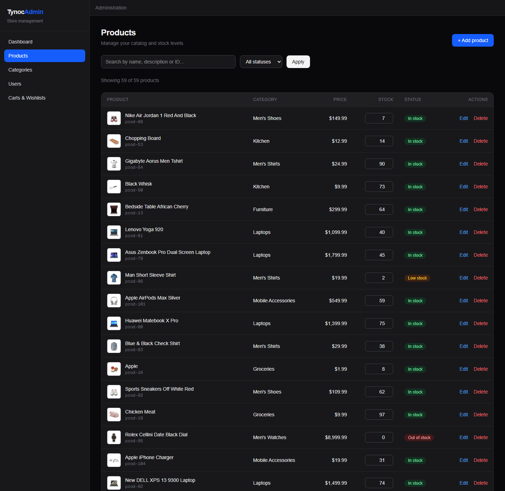 |

| Low-stock filter | Add product |
| ---------------- | ----------- |
| 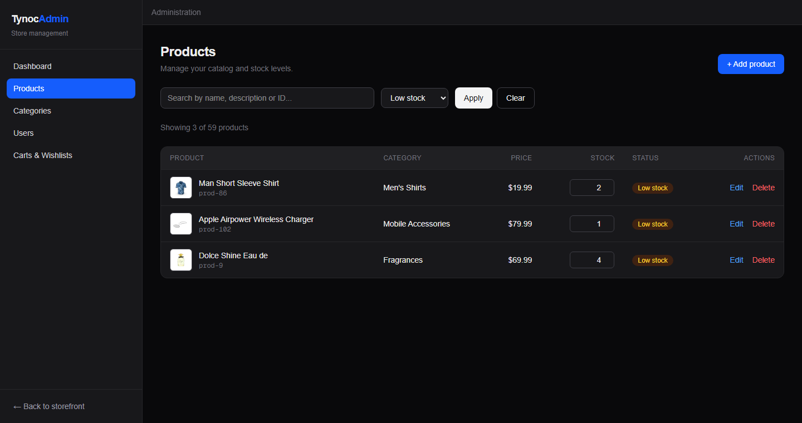 | 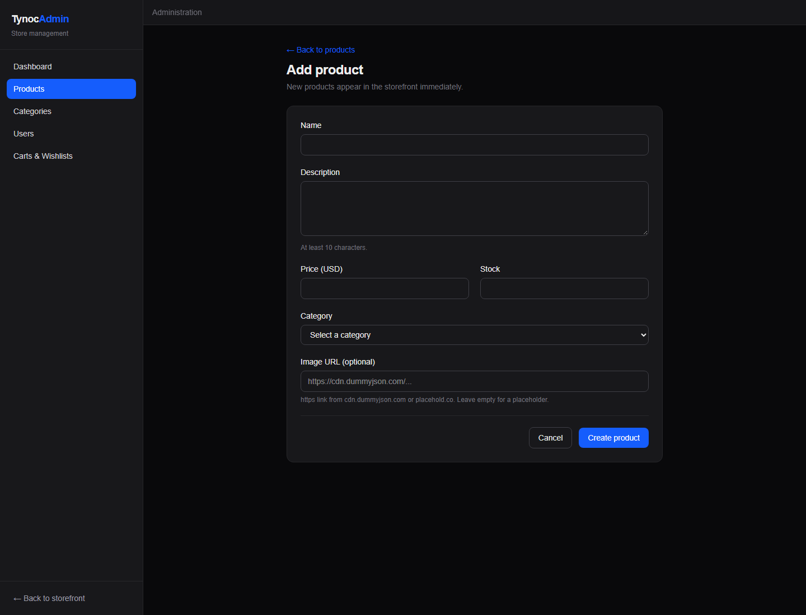 |

| Edit product | Categories |
| ------------ | ---------- |
| 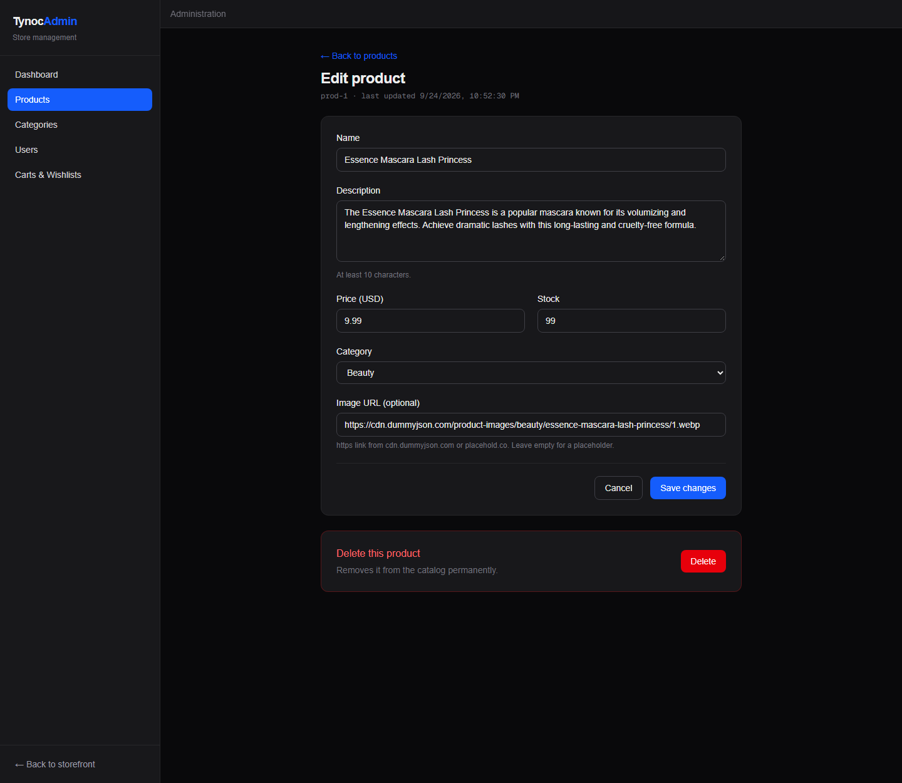 | 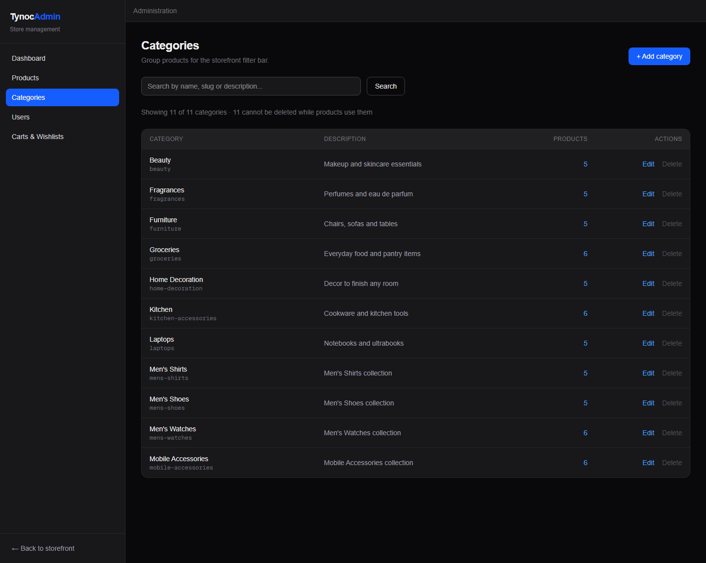 |

| Users | User detail |
| ----- | ----------- |
| 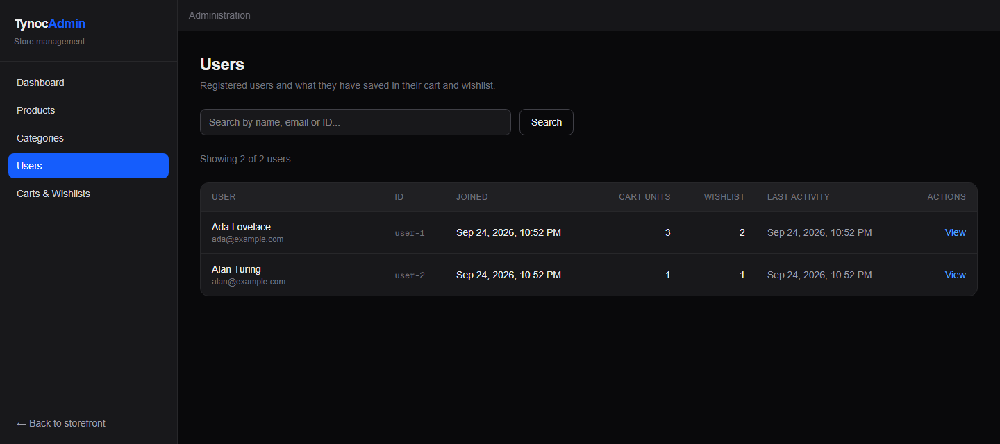 | 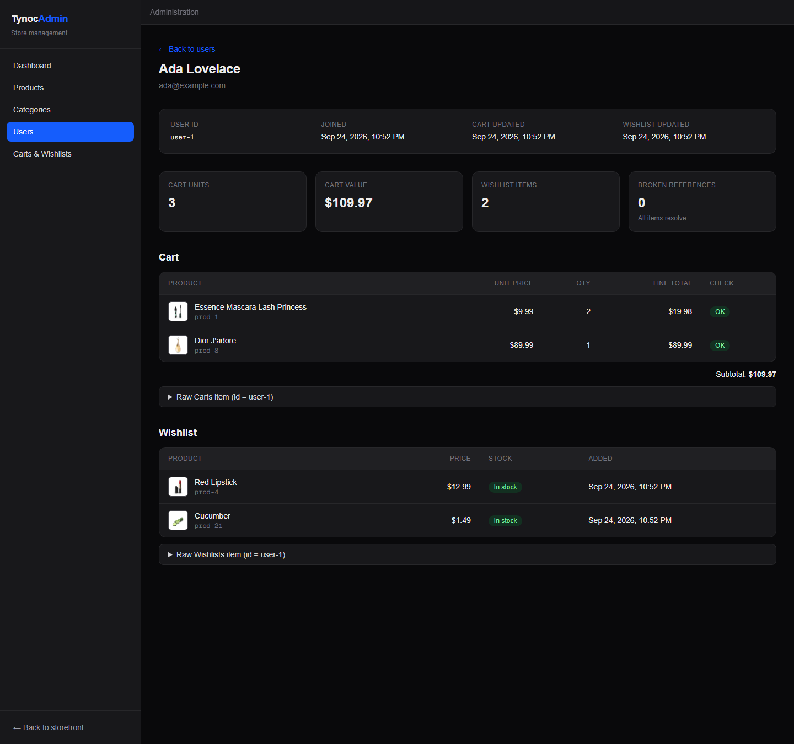 |

| Inspector: carts | Inspector: products |
| ---------------- | ------------------- |
| 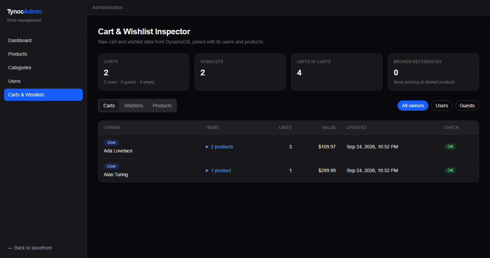 | 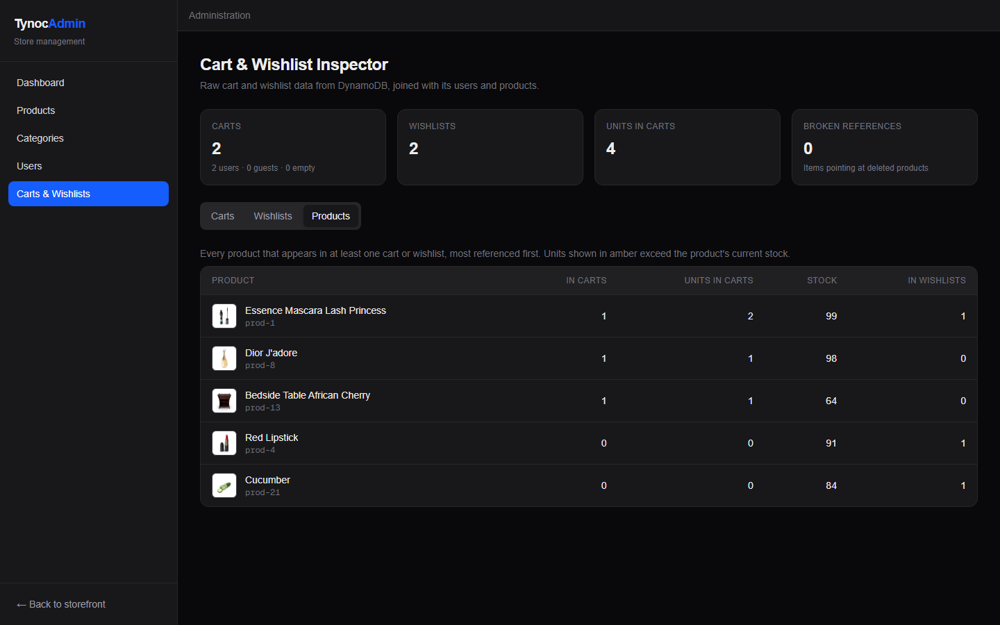 |

| Empty state | Storefront |
| ----------- | ---------- |
| 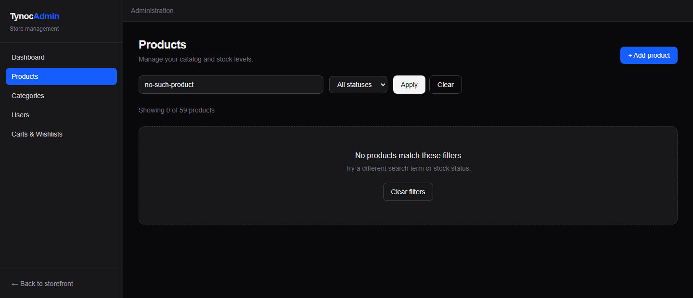 | 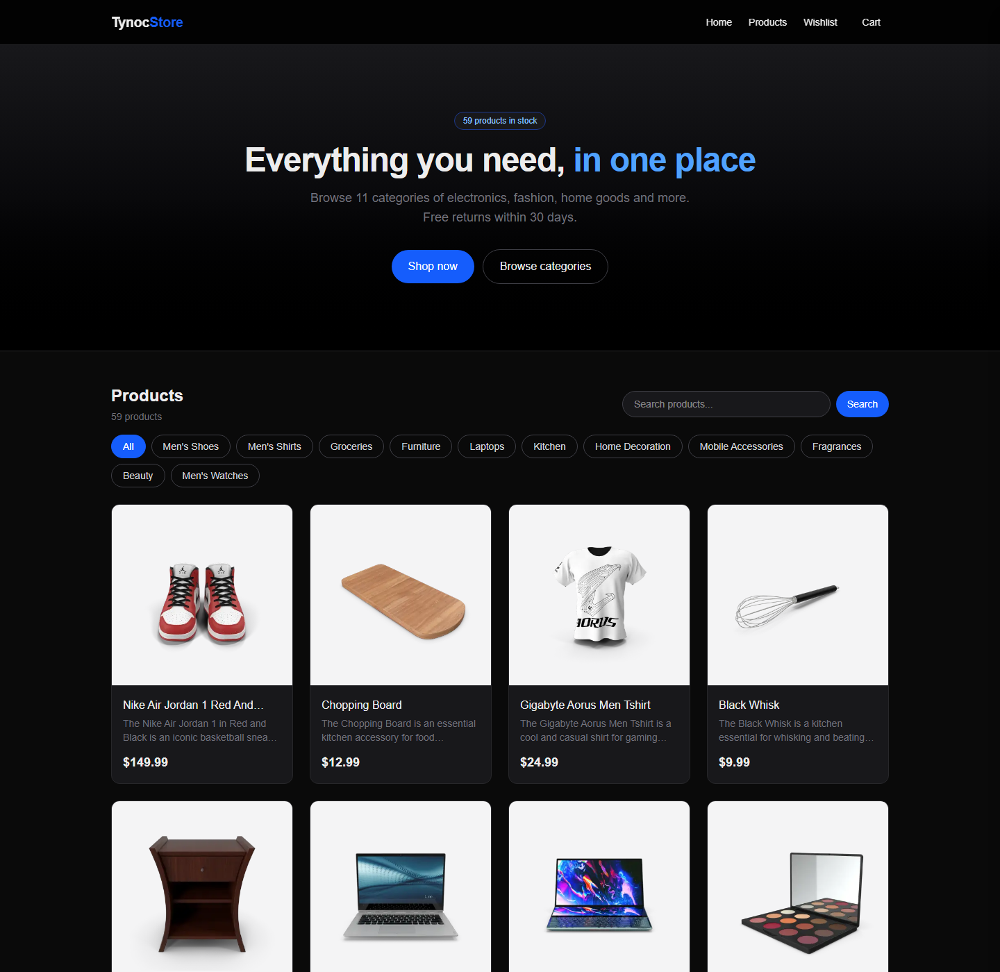 |

| Error boundary | Database offline |
| -------------- | ---------------- |
| 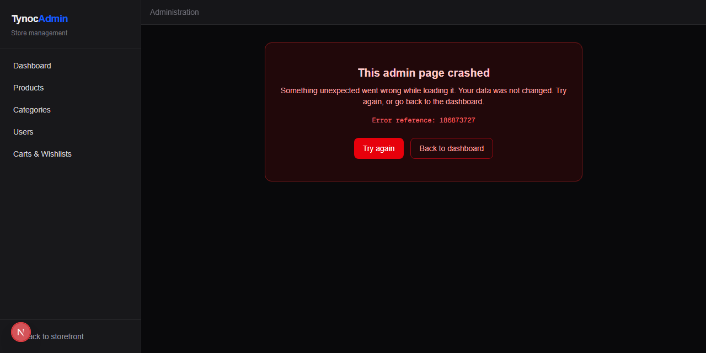 | 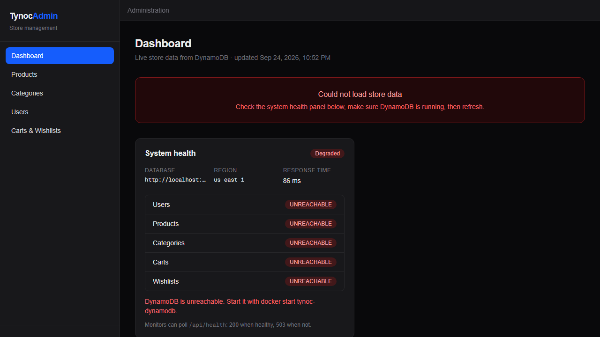 |

---

## Known Limitations & Next Steps

- **Admin auth is a single shared password.** Next step: real accounts with
  roles (for example Auth.js or Amazon Cognito), which also enables logout and
  an audit log of who changed what.
- **Shoppers have no login yet.** Carts belong to a guest session cookie; once
  users can sign in, their cart can be stored under their user id (the admin
  inspector already supports this).
- **Scans for admin lists and counts.** Fine at this size; for a large store,
  add Global Secondary Indexes for common queries and keep running counters
  (DynamoDB `ADD`) instead of scanning to count.
- **No rate limiting** on the public API; add it at the edge (for example AWS
  WAF or API Gateway) before a public launch.
